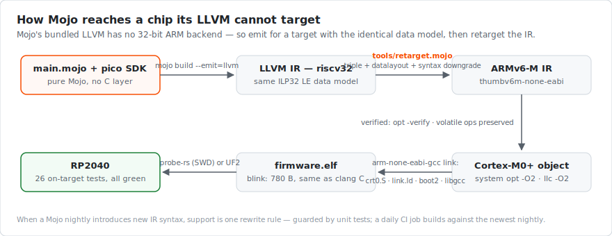
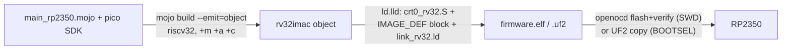
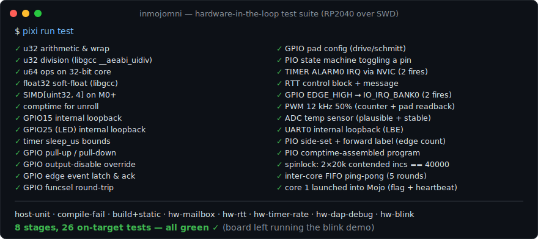
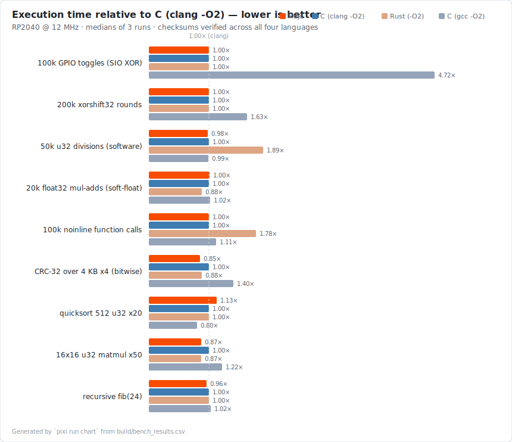
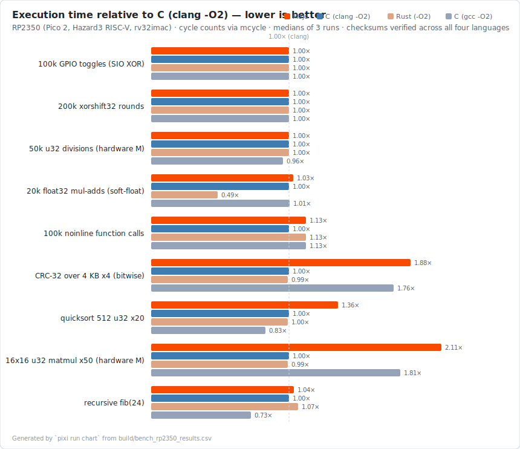

# inmojomni

*Inmojomni Never Makes Ordinary Jokes On MMIO, Nor Interrupts.*

[](https://github.com/Hundo1018/inmojomni/actions/workflows/ci.yml)
[](LICENSE)
[](https://docs.modular.com/mojo/)
[%20%7C%20RP2350%20(Hazard3%20RISC--V)-8A2BE2)](https://www.raspberrypi.com/documentation/microcontrollers/silicon.html)

**Bare-metal Raspberry Pi Pico (RP2040) and Pico 2 (RP2350) firmware, written in Mojo.**

No OS, no C application layer. The application and the SDK are pure Mojo; startup is
about 60 lines of assembly and one linker script. A complete blink firmware is
**780 bytes**, and measured performance **matches C compiled with the same LLVM
backend on every workload** (see [Benchmarks](#benchmarks)).

```mojo
import pico
from pico import Pin, pins, sleep_ms


@export("mojo_main")
def start() abi("C"):
    pico.init()

    var led = Pin[pins.LED]()   # pin number is a compile-time parameter;
    led.make_output()           # Pin[99]() is a compile-time error

    while True:
        led.toggle()
        sleep_ms(250)
```

> **Status: experimental.** Built on the Mojo nightly toolchain; the language is not
> yet 1.0. Every claim in this README is backed by an automated test that runs on
> real hardware (`pixi run test`).

## Why this is interesting

- **Zero language overhead, measured.** Against C built with the same LLVM
  backend (`clang -O2`) and Rust, Mojo matches register-loop workloads to the
  microsecond and stays within ±13% on larger ones (sorting, CRC, matmul,
  recursion) — checksums verified across all four implementations, three runs
  each. Full methodology: [docs/BENCHMARKS.md](docs/BENCHMARKS.md).
- **Compile-time hardware safety.** GPIO pins, PIO blocks and state machines are
  type parameters. An out-of-range pin (`Pin[30]()` on the RP2040) fails to
  *compile* — a test guarantees this stays true.
- **Real debugging, both chips.** VS Code F5 gives breakpoints, stepping,
  registers, memory and SVD peripheral views in `.mojo` sources — probe-rs on
  the RP2040, the raspberrypi/openocd fork + gdb on the Pico 2's RISC-V
  cores. Both paths are exercised by automated gates (DAP protocol on the
  RP2040; flash/hbreak/step/source-line assertions on the RP2350).
- **Tiny binaries, same size as C.** The complete blink is 780 B — byte-for-
  byte the size of the same-backend C blink on the identical rig (Rust: 784 B,
  gcc: 712 B; `pixi run sizes` reproduces the comparison). Registers defined
  in Mojo fold to immediates; the register map has no runtime footprint.
- **Hardware-in-the-loop test suite.** 26 on-target tests (arithmetic, u64,
  soft-float, SIMD, GPIO loopback/pulls/events/interrupts, timer, PIO with
  side-set, NVIC, RTT, PWM, ADC, UART, dual-core launch, hardware spinlocks,
  inter-core FIFO) report through a RAM mailbox read back over SWD.
- **The toolchain is Mojo, too.** The build pipeline, IR retargeting pass, ELF
  verifier and benchmark driver are Mojo programs; Python remains only as the
  test orchestrator and DAP protocol client.
- **Two chips, one SDK — including native RISC-V.** The same `pico` SDK targets
  the RP2040 (Arm Cortex-M0+) and the RP2350 / Pico 2 (Hazard3 RISC-V). On the
  RP2350 there is *no* retargeting — Mojo compiles straight for the RISC-V cores.
  The chip is a compile-time parameter, so the Pico 2 blink is line-for-line the
  RP2040 blink with one different import, and the abstraction is zero-cost: the
  chip-generic SDK emits byte-identical machine code to the hand-written version
  (verified by `.text` diff). Confirmed booting and blinking on real Pico 2
  silicon.

## What works today

| Capability | RP2040 (Pico) | RP2350 (Pico 2) | Verified by |
|---|---|---|---|
| Native-feeling SDK (`Pin[N]`, `init`, `sleep_ms`) | ✅ | ✅ | on-target tests / blink |
| Build pipeline | IR retarget → Arm | **direct RISC-V emit** | ELF checks, `picotool` image type |
| GPIO in/out, pulls, events | ✅ | ✅ (in/out) | electrical read-back via `GPIO_IN` |
| PIO state machines (comptime assembler) | ✅ | ✅ incl. **PIO2** | square wave observed on the pad |
| Dual-core launch + inter-core FIFO | ✅ | ✅ | host-recomputed checksum, both paths |
| 1 µs hardware timer, PWM, ADC, UART | ✅ | ✅ | HIL suite / ratio+loopback gates |
| External interrupts | ✅ NVIC | ✅ Xh3irq | timer-IRQ dispatch gate |
| RTT logging over SWD | ✅ | ✅ | live control-block handshake gate |
| VS Code F5 debugging (source-level) | ✅ | ✅ (openocd fork + gdb) | automated DAP / gdb gates |
| Four-language benchmark | ✅ | ✅ | checksum equality across languages |
| Probe flash + verify (no button) | ✅ probe-rs | ✅ openocd fork | verified write-back |
| Automated on-hardware testing | SWD mailbox | **probe-free flash mailbox** | every claim above |

## How it works

Mojo's bundled LLVM has no 32-bit ARM backend. The build pipeline works around
this by emitting IR for a target with an identical data model, then retargeting:



riscv32 and ARMv6-M share the ILP32 little-endian data model, so the IR is
layout-compatible; the retarget step rewrites the triple and datalayout and
downgrades IR constructs the system LLVM does not know yet (`captures(none)`,
`#dbg_*` records, `f0x` float literals, single-argument lifetime intrinsics).
The rewrite is guarded by unit tests, `opt -verify`, and a check that the number
of volatile operations is preserved end to end. When a Mojo nightly introduces
new syntax, supporting it is one rule in [tools/retarget.mojo](tools/retarget.mojo).
The pipeline driver itself is a Mojo program ([tools/build.mojo](tools/build.mojo)).

### The RP2350 (Pico 2) needs none of this

The Hazard3 cores on the RP2350 are RISC-V, so Mojo's `riscv32` backend targets
them **directly** — `mojo build --emit=object`, no IR retargeting, no external
`llc`. This is the same riscv32 output the RP2040 path *starts* from, minus the
whole retarget-to-Arm step. The chip-specific parts — the boot block the RP2350
ROM checks to arch-switch into RISC-V, the moved peripheral map, the pad-ISO
step, the interleaved SIO offsets — all live in the SDK's chip descriptor
([src/pico/chips.mojo](src/pico/chips.mojo)), selected by the chip parameter, so
none of it reaches user code:

```mojo
from pico.pico2 import Pin, pins, init, sleep_ms   # only this line differs

@export("mojo_main")
def start() abi("C"):
    init()
    var led = Pin[pins.LED]()
    led.make_output()
    while True:
        led.toggle()
        sleep_ms(250)
```



Build it with `pixi run mojo run -I tools tools/build.mojo --chip rp2350`. The
result is a native RISC-V image (`picotool` reports image type RISC-V), verified
booting and blinking on a Pico 2.

Verified on Pico 2 hardware beyond blink: **PIO** (a state-machine square wave
observed back through the pad input path — on PIO0 and on the RP2350-only
PIO2), **dual-core** (bootrom FIFO handshake, RISC-V flavour: mtvec +
`h3.unblock`; core 1 result checked over both the FIFO and volatile RAM), and
the full [four-language benchmark](#rp2350--pico-2-hazard3-risc-v) below. The
same `StateMachine[P, SM]` and `multicore.launch()` drive both chips; the chip
is one more compile-time parameter.

RP2350 tests run through a fully automated loop that needs **no debug probe
and no button**:


The firmware writes results to a reserved flash sector and reboots itself into
BOOTSEL via the ROM, where the host reads the sector back over PICOBOOT USB.
The two obvious shortcuts do not exist on this chip — the RP2350 bootrom
clears **all** of main SRAM on reboot (so an RP2040-style RAM mailbox is
impossible), and the Arm debug AP faults while the cores run RISC-V (so SWD
cannot poll a running Hazard3) — both facts verified on hardware and designed
around. One 36-stage benchmark session runs unattended end to end.

## Getting started

### Hardware

- Raspberry Pi Pico (RP2040)
- Optional but recommended: Raspberry Pi Debug Probe or any CMSIS-DAP probe,
  wired to the SWD pins. Flashing, the hardware test suite and debugging use it.
  Without a probe you can still build and deploy via `pixi run uf2` (BOOTSEL
  drag-and-drop).

### Software

Ubuntu/Debian:

```sh
sudo apt install gcc-arm-none-eabi llvm clang openocd gdb-multiarch
cargo install probe-rs-tools        # or see probe.rs for installers
curl -fsSL https://pixi.sh/install.sh | bash
# optional, only for the Rust benchmark baseline:
rustup target add thumbv6m-none-eabi
```

### Using the SDK as a library

The `pico` Mojo package installs into any pixi project straight from git —
no clone needed:

```sh
pixi init myproject && cd myproject
pixi workspace channel add https://conda.modular.com/max-nightly
# git dependencies use the pixi-build preview: add to [workspace] in pixi.toml
#   preview = ["pixi-build"]
pixi add --git https://github.com/Hundo1018/inmojomni.git inmojomni
```

Then `import pico` (or `from pico.pio import Asm`, ...) in your Mojo code.
The packaged library serves host-side tooling — PIO program generation and
verification, register maps, chip metadata. Building flashable firmware also
needs this repo's IR-retarget pipeline and runtime files, so firmware
development uses a clone:

### Build and run

```sh
git clone https://github.com/Hundo1018/inmojomni.git && cd inmojomni
pixi install        # fetches the pinned Mojo nightly toolchain (first time only)
pixi run flash      # build + flash over SWD; the LED starts blinking
```

| Task | Description |
|---|---|
| `pixi run build` | Build `build/firmware.elf` |
| `pixi run flash` | Build and flash over SWD |
| `pixi run uf2` | Build `build/firmware.uf2` for BOOTSEL drag-and-drop (no probe needed) |
| `pixi run test` | Full test suite; hardware stages are skipped when no probe is attached |
| `pixi run test-host` | Host-only tests (no hardware required) |
| `pixi run bench` | On-target Mojo vs C vs Rust benchmark (requires probe, `clang`, `rustc`) |
| `pixi run bench-rp2350` | Same four-language benchmark on a Pico 2 in BOOTSEL (no probe needed) |
| `pixi run features-rp2350` | Mojo language-feature measurements on Pico 2 silicon |
| `pixi run piomc-rp2350` | Pico 2 PIO (incl. PIO2) + dual-core hardware proof |
| `pixi run flash-rp2350` / `flash-debug-rp2350` | Build + flash Pico 2 over SWD (no BOOTSEL button) |
| `pixi run debug-test-rp2350` | Automated Pico 2 debug gate: flash, hw breakpoints, stepping, .mojo source lines |
| `pixi run periph-rp2350` | Pico 2 TIMER/PWM/ADC/UART + Xh3irq interrupt gates |
| `pixi run rtt-rp2350` | Pico 2 live RTT handshake over SWD |
| `pixi run chart` | Regenerate `docs/assets/benchmarks.svg` from the last bench run |
| `pixi run build-debug` / `flash-debug` | Debug firmware, used by the VS Code F5 flow |

To build a different entry point:
`pixi run mojo run -I tools tools/build.mojo --flash examples/pio_blink.mojo`

## Debugging (VS Code, F5)

Install the **probe-rs-debugger** extension, open this folder, press **F5**. This
builds a debug firmware, flashes it, and attaches:

- Breakpoints in `.mojo` files — including inside loops, with repeated hits
- Step over / into / out; variables, CPU registers, call stack, memory view
- Live RP2040 peripheral registers (SIO, IO_BANK0, TIMER, …) via the bundled SVD

The debug build uses `-g` plus `--no-optimization`, so lines inside loops keep
addressable call instructions — the same trade-off as a Rust/C debug profile.
The entire flow (three breakpoint hits, stepping, scopes, memory reads) is
validated over the DAP protocol on every `pixi run test`.

Known upstream issues, already worked around in [.vscode/launch.json](.vscode/launch.json):
probe-rs's *launch* flow arms breakpoints while the RP2040 is halted in the boot
ROM, where they never take effect, so the default configuration flashes first and
*attaches*. Mainline OpenOCD + GDB has a related RP2040 bug where breakpoints stop
re-arming after the first hit; `probe-rs` tooling is recommended for CLI debugging.

### Debugging the Pico 2 (RP2350, RISC-V)

The same F5 standard, different plumbing: probe-rs has no RISC-V RP2350
support, so the Pico 2 uses the
[raspberrypi/openocd](https://github.com/raspberrypi/openocd) fork, which
reaches the Hazard3 cores' RISC-V Debug Module (spec 0.13.2: run/halt,
single-step, 4 hardware breakpoint triggers per core) through the same SWD
probe at AP `0xa000`. `gdb-multiarch` speaks to openocd; the VS Code config
"inmojomni Pico 2 (RISC-V flash + debug)" builds a debug firmware, flashes
it over SWD (no BOOTSEL button) and gives breakpoints in `.mojo` sources,
stepping, registers and memory. Build the fork once:

```sh
sudo apt install libtool automake autoconf texinfo libusb-1.0-0-dev libhidapi-dev gdb-multiarch
git clone --depth 1 https://github.com/raspberrypi/openocd && cd openocd
git submodule update --init --depth 1 jimtcl
./bootstrap && ./configure --prefix=$HOME/.local --enable-cmsis-dap \
    --enable-cmsis-dap-v2 --enable-internal-jimtcl --disable-werror
make -j$(nproc) && make install
```

Everything above is enforced by an automated gate — `pixi run
debug-test-rp2350` flashes over SWD with verify, then asserts: a hardware
breakpoint on `mojo_main` hits, single-stepping advances the PC, memory and
CSR reads return known values (`misa` = rv32imac), and a hardware
breakpoint set on the `.mojo` source line of `led.toggle()` hits on two
consecutive blink iterations.

## SDK overview

### GPIO (`pico.gpio`)

`Pin[N]` takes the pin number as a compile-time parameter: each pin is a distinct
type, out-of-range pins fail to compile, and operations compile down to one or two
instructions. Pad configuration uses the RP2040 atomic SET/CLR/XOR aliases, so
there are no read-modify-write races.

| Category | API |
|---|---|
| Direction | `make_output()` `make_input()` `is_output()` |
| Output | `high()` `low()` `toggle()` `write(b)` `read_output()` |
| Input | `read()` (through the 2-stage clk_sys synchronizer) |
| Pulls | `pull_up()` `pull_down()` `pull_none()` `bus_keep()` |
| Pad control | `set_drive(Drive.MA_2/4/8/12)` `schmitt(b)` `slew_fast(b)` `input_enable(b)` `output_disable(b)` |
| Function select | `set_function(Function.SPI/UART/I2C/PWM/SIO/PIO0/PIO1/GPCK/USB)` `get_function()` |
| Events | `events()` `ack_events(Event.EDGE_HIGH/EDGE_LOW/LEVEL_HIGH/LEVEL_LOW)` (polled) |

### Pin names (`pico.pins`)

`GP0..GP28`, `LED`, `VBUS_SENSE`, `SMPS_MODE`, `ADC0-2`, and default
`UART0_TX/RX`, `I2C0_SDA/SCL`, `SPI0_*` aliases. Usage: `Pin[pins.LED]()`.

### PIO (`pico.pio`)

PIO programs are written as method calls with labels as ordinary values — not as
assembler strings:

```mojo
var asm = Asm()
var top = asm.label()
asm.set_pindirs(1)
asm.set_pins(1)
asm.set_x(29)
var wait1 = asm.label()
asm.jmp_x_dec(wait1, delay=2)  # burn cycles in an X loop
asm.set_pins(0)
asm.jmp(top)

var sm = StateMachine[0, 0]()  # PIO0/SM0 — both checked at compile time
sm.load(asm)                   # wrap configured automatically
sm.set_set_pins(pins.LED, 1)
sm.set_clkdiv(65535)
sm.enable()                    # the CPU can now sleep; PIO drives the LED
```

Supported today: SET, JMP (all conditions), WAIT, OUT, PULL, MOV, NOP, delay
cycles, **side-set** (`asm.side_set(n)` + `side=` on any instruction, optional
and pindirs modes included), **forward labels** (`asm.future()` / `asm.bind()`),
clock dividers, wrap, `exec()`, TX FIFO, `pc()`.

The assembler also runs at **compile time**: assign the program to a
`comptime` value and the instruction words become flash constants, with
`comptime assert` turning invalid programs into build errors:

```mojo
comptime PROG = make_program()               # assembled during compilation
comptime assert PROG.unresolved() == 0       # unbound label = build error
sm.load(PROG)
```

Instruction encodings are pinned by host-side unit tests
([tests/host/test_pio_asm.mojo](tests/host/test_pio_asm.mojo)); hardware
behavior (including a comptime-assembled program) by the on-target suite.
A complete example is
[examples/pio_blink.mojo](examples/pio_blink.mojo), verified on hardware with the
CPU idle.

### Timing (`pico.time`) and board bring-up (`pico.init()`)

`time_us()` / `sleep_us()` / `sleep_ms()` on the 1 MHz hardware timer, wrap-safe.
`alarm0_arm(us)` / `alarm0_ack()` drive the TIMER ALARM0 interrupt.
`pico.init()` starts the 12 MHz crystal, performs a glitchless clock switch,
configures the 1 µs timebase and releases GPIO from reset.

### Interrupts (`pico.irq`)

NVIC control (`enable` / `disable` / `pend` / `clear_pending`) plus the RP2040
IRQ number table. Handler binding is static, at link time: export a C-ABI
function named after the vector slot and it replaces the weak default in
`crt0.S` — no RAM vector table, no runtime registration, no function pointers.

```mojo
import pico.irq as irq
from pico.time import alarm0_ack, alarm0_arm


@export("isr_irq0")            # TIMER_IRQ_0 vector
def on_alarm0() abi("C"):
    alarm0_ack()
    # ... handler body ...

irq.enable(irq.TIMER_IRQ_0)
alarm0_arm(1000)               # fires in 1 ms
```

Verified on hardware by an on-target test: two asynchronous ALARM0 fires
through the NVIC while the main loop polls a counter. GPIO edge/level
events route the same way: `pin.irq_enable(Event.EDGE_HIGH)` +
`irq.enable(irq.IO_IRQ_BANK0)`, handler exported as `isr_irq13`.

### PWM (`pico.pwm`)

The slice/channel for a GPIO is fixed by hardware, so `Pwm[PIN]` derives both
at compile time; an out-of-range pin is a compile error.

```mojo
from pico.pwm import Pwm

var pwm = Pwm[15]()      # slice 7 channel B, funcsel switched automatically
pwm.set_top(999)         # 12 MHz / 1000 = 12 kHz
pwm.set_level(500)       # 50% duty
pwm.enable()
```

### ADC (`pico.adc`)

12-bit SAR: channels 0-3 are GPIO26-29, channel 4 is the internal temperature
sensor — `adc.read_temp_milli_c()` needs zero external parts. clk_adc runs
from the 12 MHz crystal (no PLL in this project): conversions take 8 µs
instead of 2 µs, same result bits.

### UART (`pico.uart`)

Polled PL011 driver for UART0: `uart.init(115_200)`, `write_byte`,
`read_byte(timeout_us)`. The peripheral's internal loopback mode
(`uart.loopback(True)`) is what lets the test suite verify TX->RX framing
with zero wiring.

### Spinlocks (`pico.sync`)

The RP2040's 32 hardware spinlocks, as compile-time-checked types. Verified by
a genuinely contended test: both cores perform 20,000 read-modify-write
increments each on one RAM word under `Spinlock[0]`; the total is exactly
40,000 every run.

```mojo
from pico.sync import Spinlock

var lock = Spinlock[0]()
lock.acquire()
# ...critical section...
lock.release()
```

### Dual-core (`pico.multicore`)

`multicore.launch()` wakes core 1 out of the bootrom via the SIO-FIFO
handshake and starts `mojo_core1_main` — export it exactly like the entry
point. Core 1 gets its own 4 KB stack; coordinate through volatile RAM
(`pico.mmio`).

```mojo
import pico.multicore as multicore


@export("mojo_core1_main")
def core1() abi("C"):
    while True:
        ...                       # runs on core 1

var ok = multicore.launch()       # from core 0; False instead of hanging
```

After launch, `multicore.fifo_push(v, timeout_us)` and
`multicore.fifo_pop(timeout_us)` exchange words over the 8-deep inter-core
hardware FIFO (verified by a core-to-core echo test).

### RTT logging (`pico.rtt`)

A SEGGER-RTT-compatible up channel: `rtt.init()`, then `rtt.write("...")`,
`rtt.write_u32(n)`, `rtt.write_hex(x)`. Any RTT-aware host tool streams it
over SWD with no UART wiring:

```sh
probe-rs attach --chip RP2040 build/firmware.elf   # prints RTT output
```

Overflow policy is drop-not-block, so logging never changes firmware timing.
The control block layout and message delivery are verified over SWD by the
test suite.

### Safety model

- **Compile time:** pin, PIO block and state-machine indices are checked by
  `comptime` assertions; violations are compile errors, and a compile-fail test
  keeps them that way.
- **Run time:** standard-library bounds-check violations trap to a `bkpt`
  instruction, stopping the attached debugger at the fault. This machinery costs
  roughly 1.5–5 KB when bounds-checked stdlib features are used (details in
  [docs/BENCHMARKS.md](docs/BENCHMARKS.md)).
- `UnsafePointer` and volatile access are confined to one module, `pico.mmio`.

## Testing



`pixi run test` runs everything; stages that need hardware are skipped when no
probe is present.

| Stage | What it checks |
|---|---|
| host-unit | IR retarget rules against synthetic new-LLVM syntax, then `opt -verify`; volatile-op count preservation; boot2 CRC self-check; PIO assembler encodings incl. side-set, forward-label fixups and comptime==runtime equivalence |
| compile-fail | `Pin[30]()` must be rejected at compile time |
| build+static | Three firmware builds; ELF verification (boot2 CRC32, vector table, memory bounds); DWARF line tables present |
| hw-mailbox | 26 on-target Mojo tests: arithmetic, division, u64, soft-float, SIMD, comptime unrolling, GPIO loopback/pulls/events/interrupts, timer, PIO incl. side-set + forward labels + comptime assembly, NVIC dispatch, RTT, PWM, ADC temperature, UART loopback, dual-core launch, contended spinlocks, inter-core FIFO |
| hw-rtt | RTT control block and message read back over SWD, exactly as an RTT host tool would |
| hw-timer-rate | Hardware timer measures ≈1 MHz against the host clock |
| hw-dap-debug | Full F5 experience over the DAP protocol: breakpoint hits, stepping, scopes, memory reads |
| hw-blink | Reflash blink and observe LED transitions (the board always ends up blinking) |

GPIO tests require no wiring: input-enable is on by default, so driven outputs
are read back through `GPIO_IN`.

RP2350 on-target verification runs through the probe-free flash-mailbox loop
instead (see above): `pixi run piomc-rp2350` gates the dual-core launch (FIFO
and RAM result paths against a host-recomputed value) and PIO0/PIO2 square
waves observed through the pad input path; `pixi run bench-rp2350` and
`pixi run features-rp2350` enforce their own checksum gates.

## Benchmarks

Measured on hardware: same board, same startup code, same linker script, same
clocks, timed by the 1 MHz hardware timer. Every workload writes a checksum;
the host verifies **all four implementations computed identical results**, and
each firmware runs the whole suite three times (medians reported, cross-run
spread under 2% enforced). Baselines: `arm-none-eabi-gcc -O2`, `clang -O2`
(the same LLVM backend the Mojo pipeline uses — the fair yardstick for
language overhead) and Rust `-C opt-level=2` (also LLVM), all linked with the
same crt0 and libgcc.



| Workload | Mojo | C (gcc) | C (clang) | Rust | Mojo / clang |
|---|---:|---:|---:|---:|---:|
| 100k GPIO toggles (volatile) | 8,834 µs | 41,668 µs | 8,835 µs | 8,835 µs | 1.00 |
| 200k xorshift32 rounds | 102,501 µs | 166,668 µs | 102,501 µs | 102,501 µs | 1.00 |
| 50k u32 divisions (software) | 109,673 µs | 110,923 µs | 111,756 µs | 211,686 µs | 0.98 |
| 20k float32 mul-adds (soft-float) | 598,833 µs | 609,566 µs | 596,815 µs | 525,915 µs | 1.00 |
| 100k noinline function calls | 75,001 µs | 83,334 µs | 75,001 µs | 133,334 µs | 1.00 |
| CRC-32 over 4 KB ×4 (bitwise) | 68,958 µs | 114,012 µs | 81,246 µs | 71,690 µs | 0.85 |
| quicksort 512 u32 ×20 | 230,148 µs | 164,060 µs | 204,537 µs | 204,484 µs | 1.13 |
| 16×16 u32 matmul ×50 | 137,951 µs | 193,652 µs | 159,201 µs | 139,127 µs | 0.87 |
| recursive fib(24) | 161,079 µs | 171,437 µs | 167,330 µs | 167,331 µs | 0.96 |

On the register-loop microbenchmarks, Mojo and same-backend C produce identical
machine code — the 200k-round PRNG loop times are equal to the microsecond
across Mojo, clang C and Rust. On the larger workloads Mojo stays within ±13%
of clang C, ahead on CRC-32 and matmul, behind on quicksort, with no systematic
drop-off as programs grow. Rust diverges exactly where it links its own
compiler-builtins instead of libgcc (division, soft-float): those rows compare
runtime libraries, not languages. Interpreted Python firmwares
(MicroPython/CircuitPython) were **not** measured. Full methodology, binary
sizes and caveats: [docs/BENCHMARKS.md](docs/BENCHMARKS.md). Reproduce:
`pixi run bench` (probe, `clang`, and `rustc` with the `thumbv6m-none-eabi`
target), then `pixi run chart`.

### RP2350 / Pico 2 (Hazard3, RISC-V)

The same nine workloads on the Pico 2, with every language compiled for
**rv32imac** (the Hazard3's actual ISA — hardware multiply and divide) and
timed by the **`mcycle` cycle counter** through one shared `read_mcycle`
symbol, so results are CPU cycles and immune to ring-oscillator frequency
drift. No probe and no button: results return over the flash-mailbox /
PICOBOOT loop described above. Same gates: identical checksums across runs
and languages, cross-run spread under 2%.



| Workload | Mojo | C (gcc) | C (clang) | Rust | Mojo / clang |
|---|---:|---:|---:|---:|---:|
| 100k GPIO toggles (volatile) | 300,013 | 300,013 | 300,010 | 300,012 | 1.00 |
| 200k xorshift32 rounds | 1,600,013 | 1,600,013 | 1,600,011 | 1,600,013 | 1.00 |
| 50k u32 divisions (hardware M) | 1,250,015 | 1,200,016 | 1,200,010 | 1,250,015 | 1.04 |
| 20k float32 mul-adds (soft-float) | 6,048,388 | 6,048,793 | 6,008,887 | 3,074,906 | 1.01 |
| 100k noinline function calls | 900,008 | 900,010 | 700,010 | 900,008 | 1.29 |
| CRC-32 over 4 KB ×4 (bitwise) | 1,183,791 | 1,110,053 | 630,848 | 626,743 | 1.88 |
| quicksort 512 u32 ×20 | 1,884,996 | 1,153,999 | 1,378,540 | 1,398,145 | 1.37 |
| 16×16 u32 matmul ×50 (hardware M) | 1,840,260 | 1,593,616 | 880,814 | 874,408 | 2.09 |
| recursive fib(24) | 1,932,944 | 1,372,190 | 1,915,229 | 1,932,942 | 1.01 |

*(cycles; lower is better)*

The Hazard3 is cycle-deterministic: runs 2 and 3 agree **to the cycle** in
every implementation (run 1 differs only by cold XIP cache; medians absorb
it). On straight-line code Mojo again matches same-backend C to within
rounding. On the nested-loop kernels this path is slower than clang C —
1.88× on CRC-32 and 2.09× on matmul — a larger gap than the same workloads
show on the RP2040/Arm path, and an open item worth investigating rather
than a rounding artifact. The Rust soft-float row again compares runtime
libraries, not languages (its compiler-builtins beat libgcc's soft-float
roughly 2×). Mojo produces the smallest firmware of the four
(`.text` 4,196 B vs 4,590–14,064 B). Reproduce: `pixi run bench-rp2350`
(Pico 2 in BOOTSEL; `clang`, riscv-gcc, and `rustc` with the
`riscv32imac-unknown-none-elf` target).

Language-feature measurements on the same silicon (traits are zero-cost;
the struct-passing register boundary is 8 bytes; a comptime lookup table in
XIP flash loses to recomputation by ~2.2×) live in
[docs/BENCHMARKS.md](docs/BENCHMARKS.md); reproduce with
`pixi run features-rp2350`.

## Project layout

```
src/main.mojo        RP2040 entry point (@export("mojo_main"))
src/main_rp2350.mojo Pico 2 / RP2350 native-RISC-V entry point (same shape)
src/pico/            SDK: mmio / rp2040 / gpio / pins / pio / time / irq / rtt /
                     pwm / adc / uart / multicore / sync / board
                     chips (per-chip register map) / pico2 (Pico 2 board module)
examples/            pio_blink.mojo, ...
runtime/             crt0.S / link.ld / boot2.bin (RP2040),
                     crt0_rv32.S / link_rv32.ld / rp2350_image_def.S (RP2350)
tools/               Mojo: build.mojo (pipeline), retarget.mojo (IR pass),
                     check_elf.mojo, bench.mojo, bench_rp2350.mojo,
                     features_rp2350.mojo, piomc_rp2350.mojo, chart.mojo, hil.mojo
                     Python (test rig only): run_tests.py, hil.py, dap_client.py,
                     picoboot_read.py (PICOBOOT USB reader for the RP2350 loop)
tests/               host/ (unit), compile_fail/, on_target/ (on-board Mojo
                     suite), on_target_rp2350/ (Pico 2: readback gate, feature
                     measurements, PIO + dual-core proof)
bench/               bench.mojo + bench.c + bench.rs (identical workloads),
                     bench_rp2350.* (same kernels, rv32imac + mcycle)
docs/                BENCHMARKS.md, design notes
.github/workflows/   CI: host test suite + firmware size gate
.vscode/             F5 debug configuration + RP2040 SVD
```

## Current limitations

- No I²C, SPI, DMA or USB drivers yet; UART is polled TX/RX only (no
  interrupts, no RX ring buffer).
- **RP2350 / Pico 2: hardware-verified surface is blink, GPIO, PIO (incl.
  PIO2), dual-core, the four-language benchmark, probe flashing and
  source-level debugging.** PWM, ADC, UART, RTT and interrupts are
  chip-generic in source and compile for the RP2350, but are exercised on
  real hardware only on the RP2040 so far. probe-rs cannot attach to a
  running Hazard3 (its RP235x target drives the M33 debug AP); flashing and
  debugging go through the raspberrypi/openocd fork instead — see
  [Debugging](#debugging-the-pico-2-rp2350-risc-v).
- The toolchain tracks Mojo *nightly*; a compiler update can require a new
  retarget rule (mechanical, test-guarded, but a moving target). A scheduled
  CI job re-tests against the newest nightly daily, so breakage surfaces
  within a day of the nightly that caused it. (The riscv32 backend both paths
  rest on is an unofficial Mojo tier — see [docs/ROADMAP.md](docs/ROADMAP.md).)

## License

[MIT](LICENSE)
