# inmojomni

[](https://github.com/Hundo1018/inmojomni/actions/workflows/ci.yml)
[](LICENSE)
[](https://docs.modular.com/mojo/)
[-8A2BE2)](https://www.raspberrypi.com/documentation/microcontrollers/silicon.html)

**Bare-metal Raspberry Pi Pico (RP2040) firmware, written in Mojo.**

No OS, no C application layer. The application and the SDK are pure Mojo; startup is
about 60 lines of assembly and one linker script. A complete blink firmware is
**780 bytes**, and measured performance **matches C compiled with the same LLVM
backend on every workload** (see [Benchmarks](#benchmarks)).

```mojo
import pico
from pico import Pin, pins, sleep_ms


@export("mojo_main")
def start() abi("C"):
    pico.init()

    var led = Pin[pins.LED]()   # pin number is a compile-time parameter;
    led.make_output()           # Pin[99]() is a compile-time error

    while True:
        led.toggle()
        sleep_ms(250)
```

> **Status: experimental.** Built on the Mojo nightly toolchain; the language is not
> yet 1.0. Every claim in this README is backed by an automated test that runs on
> real hardware (`pixi run test`).

## Why this is interesting

- **Zero language overhead, measured.** Against C built with the same LLVM
  backend (`clang -O2`) and Rust, Mojo matches register-loop workloads to the
  microsecond and stays within ±13% on larger ones (sorting, CRC, matmul,
  recursion) — checksums verified across all four implementations, three runs
  each. Full methodology: [docs/BENCHMARKS.md](docs/BENCHMARKS.md).
- **Compile-time hardware safety.** GPIO pins, PIO blocks and state machines are
  type parameters. An out-of-range pin (`Pin[30]()` on the RP2040) fails to
  *compile* — a test guarantees this stays true.
- **Real debugging.** VS Code F5 gives breakpoints, stepping, registers, memory and
  SVD peripheral views in `.mojo` sources, via `probe-rs`. The full debug path is
  exercised by an automated DAP-protocol test.
- **Tiny binaries, same size as C.** The complete blink is 780 B — byte-for-
  byte the size of the same-backend C blink on the identical rig (Rust: 784 B,
  gcc: 712 B; `pixi run sizes` reproduces the comparison). Registers defined
  in Mojo fold to immediates; the register map has no runtime footprint.
- **Hardware-in-the-loop test suite.** 26 on-target tests (arithmetic, u64,
  soft-float, SIMD, GPIO loopback/pulls/events/interrupts, timer, PIO with
  side-set, NVIC, RTT, PWM, ADC, UART, dual-core launch, hardware spinlocks,
  inter-core FIFO) report through a RAM mailbox read back over SWD.
- **The toolchain is Mojo, too.** The build pipeline, IR retargeting pass, ELF
  verifier and benchmark driver are Mojo programs; Python remains only as the
  test orchestrator and DAP protocol client.

## How it works

Mojo's bundled LLVM has no 32-bit ARM backend. The build pipeline works around
this by emitting IR for a target with an identical data model, then retargeting:

```mermaid
flowchart LR
    A["main.mojo + pico SDK"] -->|"mojo build --emit=llvm<br>target: riscv32 (same ILP32, LE)"| B["LLVM IR"]
    B -->|"retarget_ir(): rewrite triple +<br>datalayout to thumbv6m"| C["ARMv6-M IR"]
    C -->|"system opt -O2, llc -O2"| D["Cortex-M0+ object"]
    D -->|"arm-none-eabi-gcc link:<br>crt0.S + link.ld + boot2 + libgcc"| E["firmware.elf"]
    E -->|"probe-rs (SWD) or UF2"| F["RP2040"]
```



riscv32 and ARMv6-M share the ILP32 little-endian data model, so the IR is
layout-compatible; the retarget step rewrites the triple and datalayout and
downgrades IR constructs the system LLVM does not know yet (`captures(none)`,
`#dbg_*` records, `f0x` float literals, single-argument lifetime intrinsics).
The rewrite is guarded by unit tests, `opt -verify`, and a check that the number
of volatile operations is preserved end to end. When a Mojo nightly introduces
new syntax, supporting it is one rule in [tools/retarget.mojo](tools/retarget.mojo).
The pipeline driver itself is a Mojo program ([tools/build.mojo](tools/build.mojo)).

## Getting started

### Hardware

- Raspberry Pi Pico (RP2040)
- Optional but recommended: Raspberry Pi Debug Probe or any CMSIS-DAP probe,
  wired to the SWD pins. Flashing, the hardware test suite and debugging use it.
  Without a probe you can still build and deploy via `pixi run uf2` (BOOTSEL
  drag-and-drop).

### Software

Ubuntu/Debian:

```sh
sudo apt install gcc-arm-none-eabi llvm clang openocd gdb-multiarch
cargo install probe-rs-tools        # or see probe.rs for installers
curl -fsSL https://pixi.sh/install.sh | bash
# optional, only for the Rust benchmark baseline:
rustup target add thumbv6m-none-eabi
```

### Using the SDK as a library

The `pico` Mojo package installs into any pixi project straight from git —
no clone needed:

```sh
pixi init myproject && cd myproject
pixi workspace channel add https://conda.modular.com/max-nightly
# git dependencies use the pixi-build preview: add to [workspace] in pixi.toml
#   preview = ["pixi-build"]
pixi add --git https://github.com/Hundo1018/inmojomni.git inmojomni
```

Then `import pico` (or `from pico.pio import Asm`, ...) in your Mojo code.
The packaged library serves host-side tooling — PIO program generation and
verification, register maps, chip metadata. Building flashable firmware also
needs this repo's IR-retarget pipeline and runtime files, so firmware
development uses a clone:

### Build and run

```sh
git clone https://github.com/Hundo1018/inmojomni.git && cd inmojomni
pixi install        # fetches the pinned Mojo nightly toolchain (first time only)
pixi run flash      # build + flash over SWD; the LED starts blinking
```

| Task | Description |
|---|---|
| `pixi run build` | Build `build/firmware.elf` |
| `pixi run flash` | Build and flash over SWD |
| `pixi run uf2` | Build `build/firmware.uf2` for BOOTSEL drag-and-drop (no probe needed) |
| `pixi run test` | Full test suite; hardware stages are skipped when no probe is attached |
| `pixi run test-host` | Host-only tests (no hardware required) |
| `pixi run bench` | On-target Mojo vs C vs Rust benchmark (requires probe, `clang`, `rustc`) |
| `pixi run chart` | Regenerate `docs/assets/benchmarks.svg` from the last bench run |
| `pixi run build-debug` / `flash-debug` | Debug firmware, used by the VS Code F5 flow |

To build a different entry point:
`pixi run mojo run -I tools tools/build.mojo --flash examples/pio_blink.mojo`

## Debugging (VS Code, F5)

Install the **probe-rs-debugger** extension, open this folder, press **F5**. This
builds a debug firmware, flashes it, and attaches:

- Breakpoints in `.mojo` files — including inside loops, with repeated hits
- Step over / into / out; variables, CPU registers, call stack, memory view
- Live RP2040 peripheral registers (SIO, IO_BANK0, TIMER, …) via the bundled SVD

The debug build uses `-g` plus `--no-optimization`, so lines inside loops keep
addressable call instructions — the same trade-off as a Rust/C debug profile.
The entire flow (three breakpoint hits, stepping, scopes, memory reads) is
validated over the DAP protocol on every `pixi run test`.

Known upstream issues, already worked around in [.vscode/launch.json](.vscode/launch.json):
probe-rs's *launch* flow arms breakpoints while the RP2040 is halted in the boot
ROM, where they never take effect, so the default configuration flashes first and
*attaches*. Mainline OpenOCD + GDB has a related RP2040 bug where breakpoints stop
re-arming after the first hit; `probe-rs` tooling is recommended for CLI debugging.

## SDK overview

### GPIO (`pico.gpio`)

`Pin[N]` takes the pin number as a compile-time parameter: each pin is a distinct
type, out-of-range pins fail to compile, and operations compile down to one or two
instructions. Pad configuration uses the RP2040 atomic SET/CLR/XOR aliases, so
there are no read-modify-write races.

| Category | API |
|---|---|
| Direction | `make_output()` `make_input()` `is_output()` |
| Output | `high()` `low()` `toggle()` `write(b)` `read_output()` |
| Input | `read()` (through the 2-stage clk_sys synchronizer) |
| Pulls | `pull_up()` `pull_down()` `pull_none()` `bus_keep()` |
| Pad control | `set_drive(Drive.MA_2/4/8/12)` `schmitt(b)` `slew_fast(b)` `input_enable(b)` `output_disable(b)` |
| Function select | `set_function(Function.SPI/UART/I2C/PWM/SIO/PIO0/PIO1/GPCK/USB)` `get_function()` |
| Events | `events()` `ack_events(Event.EDGE_HIGH/EDGE_LOW/LEVEL_HIGH/LEVEL_LOW)` (polled) |

### Pin names (`pico.pins`)

`GP0..GP28`, `LED`, `VBUS_SENSE`, `SMPS_MODE`, `ADC0-2`, and default
`UART0_TX/RX`, `I2C0_SDA/SCL`, `SPI0_*` aliases. Usage: `Pin[pins.LED]()`.

### PIO (`pico.pio`)

PIO programs are written as method calls with labels as ordinary values — not as
assembler strings:

```mojo
var asm = Asm()
var top = asm.label()
asm.set_pindirs(1)
asm.set_pins(1)
asm.set_x(29)
var wait1 = asm.label()
asm.jmp_x_dec(wait1, delay=2)  # burn cycles in an X loop
asm.set_pins(0)
asm.jmp(top)

var sm = StateMachine[0, 0]()  # PIO0/SM0 — both checked at compile time
sm.load(asm)                   # wrap configured automatically
sm.set_set_pins(pins.LED, 1)
sm.set_clkdiv(65535)
sm.enable()                    # the CPU can now sleep; PIO drives the LED
```

Supported today: SET, JMP (all conditions), WAIT, OUT, PULL, MOV, NOP, delay
cycles, **side-set** (`asm.side_set(n)` + `side=` on any instruction, optional
and pindirs modes included), **forward labels** (`asm.future()` / `asm.bind()`),
clock dividers, wrap, `exec()`, TX FIFO, `pc()`.

The assembler also runs at **compile time**: assign the program to a
`comptime` value and the instruction words become flash constants, with
`comptime assert` turning invalid programs into build errors:

```mojo
comptime PROG = make_program()               # assembled during compilation
comptime assert PROG.unresolved() == 0       # unbound label = build error
sm.load(PROG)
```

Instruction encodings are pinned by host-side unit tests
([tests/host/test_pio_asm.mojo](tests/host/test_pio_asm.mojo)); hardware
behavior (including a comptime-assembled program) by the on-target suite.
A complete example is
[examples/pio_blink.mojo](examples/pio_blink.mojo), verified on hardware with the
CPU idle.

### Timing (`pico.time`) and board bring-up (`pico.init()`)

`time_us()` / `sleep_us()` / `sleep_ms()` on the 1 MHz hardware timer, wrap-safe.
`alarm0_arm(us)` / `alarm0_ack()` drive the TIMER ALARM0 interrupt.
`pico.init()` starts the 12 MHz crystal, performs a glitchless clock switch,
configures the 1 µs timebase and releases GPIO from reset.

### Interrupts (`pico.irq`)

NVIC control (`enable` / `disable` / `pend` / `clear_pending`) plus the RP2040
IRQ number table. Handler binding is static, at link time: export a C-ABI
function named after the vector slot and it replaces the weak default in
`crt0.S` — no RAM vector table, no runtime registration, no function pointers.

```mojo
import pico.irq as irq
from pico.time import alarm0_ack, alarm0_arm


@export("isr_irq0")            # TIMER_IRQ_0 vector
def on_alarm0() abi("C"):
    alarm0_ack()
    # ... handler body ...

irq.enable(irq.TIMER_IRQ_0)
alarm0_arm(1000)               # fires in 1 ms
```

Verified on hardware by an on-target test: two asynchronous ALARM0 fires
through the NVIC while the main loop polls a counter. GPIO edge/level
events route the same way: `pin.irq_enable(Event.EDGE_HIGH)` +
`irq.enable(irq.IO_IRQ_BANK0)`, handler exported as `isr_irq13`.

### PWM (`pico.pwm`)

The slice/channel for a GPIO is fixed by hardware, so `Pwm[PIN]` derives both
at compile time; an out-of-range pin is a compile error.

```mojo
from pico.pwm import Pwm

var pwm = Pwm[15]()      # slice 7 channel B, funcsel switched automatically
pwm.set_top(999)         # 12 MHz / 1000 = 12 kHz
pwm.set_level(500)       # 50% duty
pwm.enable()
```

### ADC (`pico.adc`)

12-bit SAR: channels 0-3 are GPIO26-29, channel 4 is the internal temperature
sensor — `adc.read_temp_milli_c()` needs zero external parts. clk_adc runs
from the 12 MHz crystal (no PLL in this project): conversions take 8 µs
instead of 2 µs, same result bits.

### UART (`pico.uart`)

Polled PL011 driver for UART0: `uart.init(115_200)`, `write_byte`,
`read_byte(timeout_us)`. The peripheral's internal loopback mode
(`uart.loopback(True)`) is what lets the test suite verify TX->RX framing
with zero wiring.

### Spinlocks (`pico.sync`)

The RP2040's 32 hardware spinlocks, as compile-time-checked types. Verified by
a genuinely contended test: both cores perform 20,000 read-modify-write
increments each on one RAM word under `Spinlock[0]`; the total is exactly
40,000 every run.

```mojo
from pico.sync import Spinlock

var lock = Spinlock[0]()
lock.acquire()
# ...critical section...
lock.release()
```

### Dual-core (`pico.multicore`)

`multicore.launch()` wakes core 1 out of the bootrom via the SIO-FIFO
handshake and starts `mojo_core1_main` — export it exactly like the entry
point. Core 1 gets its own 4 KB stack; coordinate through volatile RAM
(`pico.mmio`).

```mojo
import pico.multicore as multicore


@export("mojo_core1_main")
def core1() abi("C"):
    while True:
        ...                       # runs on core 1

var ok = multicore.launch()       # from core 0; False instead of hanging
```

After launch, `multicore.fifo_push(v, timeout_us)` and
`multicore.fifo_pop(timeout_us)` exchange words over the 8-deep inter-core
hardware FIFO (verified by a core-to-core echo test).

### RTT logging (`pico.rtt`)

A SEGGER-RTT-compatible up channel: `rtt.init()`, then `rtt.write("...")`,
`rtt.write_u32(n)`, `rtt.write_hex(x)`. Any RTT-aware host tool streams it
over SWD with no UART wiring:

```sh
probe-rs attach --chip RP2040 build/firmware.elf   # prints RTT output
```

Overflow policy is drop-not-block, so logging never changes firmware timing.
The control block layout and message delivery are verified over SWD by the
test suite.

### Safety model

- **Compile time:** pin, PIO block and state-machine indices are checked by
  `comptime` assertions; violations are compile errors, and a compile-fail test
  keeps them that way.
- **Run time:** standard-library bounds-check violations trap to a `bkpt`
  instruction, stopping the attached debugger at the fault. This machinery costs
  roughly 1.5–5 KB when bounds-checked stdlib features are used (details in
  [docs/BENCHMARKS.md](docs/BENCHMARKS.md)).
- `UnsafePointer` and volatile access are confined to one module, `pico.mmio`.

## Testing

`pixi run test` runs everything; stages that need hardware are skipped when no
probe is present.

| Stage | What it checks |
|---|---|
| host-unit | IR retarget rules against synthetic new-LLVM syntax, then `opt -verify`; volatile-op count preservation; boot2 CRC self-check; PIO assembler encodings incl. side-set, forward-label fixups and comptime==runtime equivalence |
| compile-fail | `Pin[30]()` must be rejected at compile time |
| build+static | Three firmware builds; ELF verification (boot2 CRC32, vector table, memory bounds); DWARF line tables present |
| hw-mailbox | 26 on-target Mojo tests: arithmetic, division, u64, soft-float, SIMD, comptime unrolling, GPIO loopback/pulls/events/interrupts, timer, PIO incl. side-set + forward labels + comptime assembly, NVIC dispatch, RTT, PWM, ADC temperature, UART loopback, dual-core launch, contended spinlocks, inter-core FIFO |
| hw-rtt | RTT control block and message read back over SWD, exactly as an RTT host tool would |
| hw-timer-rate | Hardware timer measures ≈1 MHz against the host clock |
| hw-dap-debug | Full F5 experience over the DAP protocol: breakpoint hits, stepping, scopes, memory reads |
| hw-blink | Reflash blink and observe LED transitions (the board always ends up blinking) |

GPIO tests require no wiring: input-enable is on by default, so driven outputs
are read back through `GPIO_IN`.

## Benchmarks

Measured on hardware: same board, same startup code, same linker script, same
clocks, timed by the 1 MHz hardware timer. Every workload writes a checksum;
the host verifies **all four implementations computed identical results**, and
each firmware runs the whole suite three times (medians reported, cross-run
spread under 2% enforced). Baselines: `arm-none-eabi-gcc -O2`, `clang -O2`
(the same LLVM backend the Mojo pipeline uses — the fair yardstick for
language overhead) and Rust `-C opt-level=2` (also LLVM), all linked with the
same crt0 and libgcc.


| Workload | Mojo | C (gcc) | C (clang) | Rust | Mojo / clang |
|---|---:|---:|---:|---:|---:|
| 100k GPIO toggles (volatile) | 8,834 µs | 41,668 µs | 8,835 µs | 8,835 µs | 1.00 |
| 200k xorshift32 rounds | 102,501 µs | 166,668 µs | 102,501 µs | 102,501 µs | 1.00 |
| 50k u32 divisions (software) | 109,673 µs | 110,923 µs | 111,756 µs | 211,686 µs | 0.98 |
| 20k float32 mul-adds (soft-float) | 598,833 µs | 609,566 µs | 596,815 µs | 525,915 µs | 1.00 |
| 100k noinline function calls | 75,001 µs | 83,334 µs | 75,001 µs | 133,334 µs | 1.00 |
| CRC-32 over 4 KB ×4 (bitwise) | 68,958 µs | 114,012 µs | 81,246 µs | 71,690 µs | 0.85 |
| quicksort 512 u32 ×20 | 230,148 µs | 164,060 µs | 204,537 µs | 204,484 µs | 1.13 |
| 16×16 u32 matmul ×50 | 137,951 µs | 193,652 µs | 159,201 µs | 139,127 µs | 0.87 |
| recursive fib(24) | 161,079 µs | 171,437 µs | 167,330 µs | 167,331 µs | 0.96 |

On the register-loop microbenchmarks, Mojo and same-backend C produce identical
machine code — the 200k-round PRNG loop times are equal to the microsecond
across Mojo, clang C and Rust. On the larger workloads Mojo stays within ±13%
of clang C, ahead on CRC-32 and matmul, behind on quicksort, with no systematic
drop-off as programs grow. Rust diverges exactly where it links its own
compiler-builtins instead of libgcc (division, soft-float): those rows compare
runtime libraries, not languages. Interpreted Python firmwares
(MicroPython/CircuitPython) were **not** measured. Full methodology, binary
sizes and caveats: [docs/BENCHMARKS.md](docs/BENCHMARKS.md). Reproduce:
`pixi run bench` (probe, `clang`, and `rustc` with the `thumbv6m-none-eabi`
target), then `pixi run chart`.

## Project layout

```
src/main.mojo        application entry point (@export("mojo_main"))
src/pico/            SDK: mmio / rp2040 / gpio / pins / pio / time / irq / rtt /
                     pwm / adc / uart / multicore / sync / board / chips
examples/            pio_blink.mojo, ...
runtime/             crt0.S (vector table, startup, trap stubs), link.ld, boot2.bin
tools/               Mojo: build.mojo (pipeline), retarget.mojo (IR pass),
                     check_elf.mojo, bench.mojo, chart.mojo, hil.mojo
                     Python (test rig only): run_tests.py, hil.py, dap_client.py
tests/               host/ (unit), compile_fail/, on_target/ (on-board Mojo suite)
bench/               bench.mojo + bench.c + bench.rs (identical workloads)
docs/                BENCHMARKS.md, design notes
.github/workflows/   CI: host test suite + firmware size gate
.vscode/             F5 debug configuration + RP2040 SVD
```

## Current limitations

- No I²C, SPI, DMA or USB drivers yet; UART is polled TX/RX only (no
  interrupts, no RX ring buffer).
- The toolchain tracks Mojo *nightly*; a compiler update can require a new
  retarget rule (mechanical, test-guarded, but a moving target).

## License

[MIT](LICENSE)
